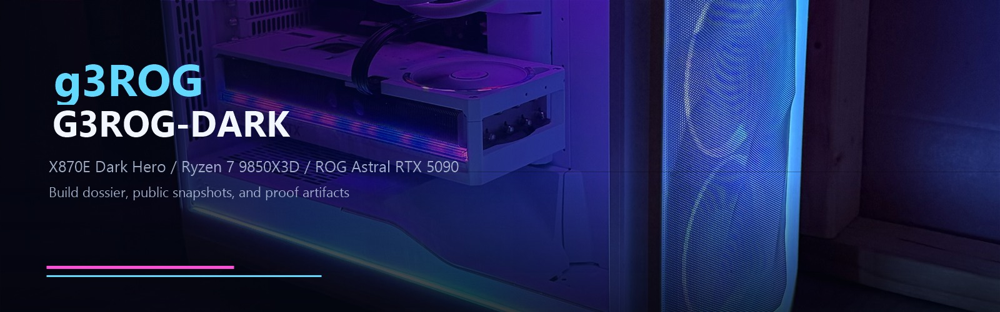
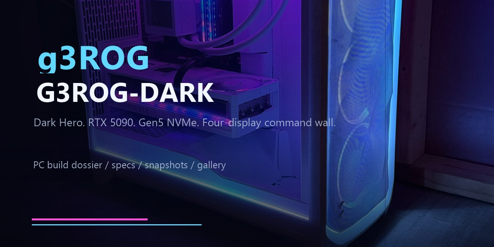

# g3ROG - PC Build Dossier

This repo is the public build journal and hardware dossier for the **g3ROG** machines: current flagship, retired snapshots, rebuild notes, benchmark artifacts, BIOS notes, galleries, and share-safe spec sheets.

The current flagship is **G3ROG-DARK**, a May 2026 Dark Hero / RTX 5090 build. The earlier **g3ROG-actual** snapshot is preserved as the pre-rebuild record before drives, RAM, and GPU moved into the new machine.

---

## Start Here

- [G3ROG web showcase](https://thatguysm.github.io/g3ROG/)
- [Latest published entrypoint](docs/LATEST.md)
- [G3ROG-DARK machine page](docs/machines/g3rog-dark/README.md)
- [G3ROG-DARK current spec](docs/g3ROG-DARK-spec.md)
- [G3ROG-DARK BIOS settings](docs/bios-settings.md)
- [G3ROG-DARK stability validation](docs/stability-validation.md)
- [G3ROG-DARK friends showcase HTML](docs/machines/g3rog-dark/exports/G3ROG-DARK-showcase-spec-2026-05-08.html)
- [G3ROG-DARK detailed internal HTML](docs/machines/g3rog-dark/exports/G3ROG-DARK-actual-spec-2026-05-08.html)
- [Documentation hub](docs/README.md)
- [Visual gallery](docs/GALLERY.md)

---

## Snapshot Notice

This repo is a **published system snapshot and build journal**, not a live telemetry feed.

- Current flagship snapshot: **G3ROG-DARK**, captured 2026-05-08 from AIDA64-backed reports and build notes.
- Historical snapshot: **g3ROG-actual**, refreshed 2026-04-16 before the rebuild path began.
- Future expansion: the rebuilt hand-me-down machine can live beside these as its own machine page once its final call sign and parts list settle.

Keep public pages share-safe. Raw reports, serial numbers, MAC addresses, UUIDs, local IPs, private domains, and other private identifiers should stay out of published docs.

## Machine Roster

| Machine | Role | Status | Start |
| --- | --- | --- | --- |
| [G3ROG-DARK](docs/machines/g3rog-dark/README.md) | Current flagship / daily driver | Active | 2026-05-08 |
| [g3ROG-actual](docs/machines/g3rog-actual/README.md) | Previous flagship snapshot | Retired / parts donor | 2026-04 snapshot |
| [Next rebuild](docs/machines/son-pc/README.md) | Son's rebuilt PC | Pending final inventory | TBD |

## Current Flagship Summary

| Component | G3ROG-DARK |
| --- | --- |
| CPU | AMD Ryzen 7 9850X3D, 8 cores / 16 threads |
| Motherboard | ASUS ROG Crosshair X870E Dark Hero |
| GPU | ASUS ROG Astral GeForce RTX 5090 O32G White |
| Memory | 64GB Corsair Dominator Titanium DDR5, observed DDR5-6200 |
| Storage | 2x Crucial T705 Gen5 NVMe + 2x Samsung 860 EVO 2TB SATA SSD |
| Cooling | ASUS ROG Ryujin III 360 ARGB AIO |
| PSU | Corsair HX1500i Platinum 1500W |
| Displays | 2x LG UltraGear 49-inch class + 2x Sceptre P30 ultrawides |
| Network | 10GbE active, 5GbE and Wi-Fi 7 available |

## Repository Layout

- `docs/`: public documentation hub, latest entrypoint, G3ROG-DARK spec, BIOS notes, validation plan, machine pages, and archived reports
- `docs/machines/`: per-machine pages, specs, exports, and snapshots
- `assets/`: banners, gallery images, social preview assets, and visual proof
- `benchmarks/`: benchmark exports and summaries
- `bios/`: BIOS tuning notes and profile references
- `logs/`: sanitized diagnostic or monitoring logs
- `scripts/`: repo setup, audit, release, export, and validation helpers

## Update Flow

1. Decide whether the update belongs to the active machine, a historical machine, or a new machine page.
2. Collect fresh local inventory with `pwsh ./scripts/collect_system_audit.ps1` when a live audit is needed.
3. Publish share-safe summaries in `docs/machines/<machine>/`.
4. Keep detailed exports near the machine they describe, preferably under `exports/` or `snapshots/YYYY-MM-DD/`.
5. Run `pwsh ./scripts/validate_repo.ps1` before pushing or tagging.

## Final Takeaway

**g3ROG is now a living build record, not just a single PC snapshot.** G3ROG-DARK gets the spotlight, g3ROG-actual keeps its receipts, and the next rebuild has a clean place to land.
