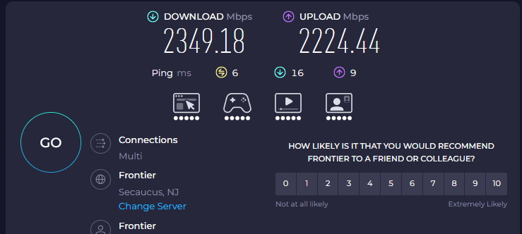
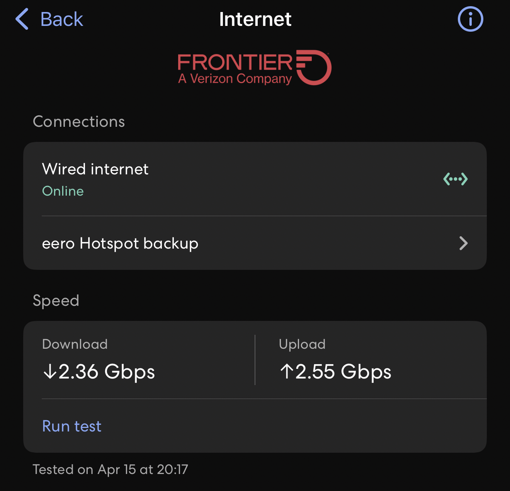

# Visual Gallery

This page collects lightweight visual proof artifacts for the current published snapshot.
These visuals support the written report without trying to replace it.

## Snapshot Context

- Snapshot date: 2026-04-15
- Focus: network validation and public-facing proof points
- Primary report: [G3-ROG-ACTUAL_System_Health_Report.md](G3-ROG-ACTUAL_System_Health_Report.md)

## Network Validation

### Desktop Speedtest.net Result

- Provider: Frontier
- Server: Secaucus, NJ
- Result: 2347.18 Mbps down / 2224.44 Mbps up
- Ping: 6 ms

### eero Max 7 Gateway Result

- Connection: wired internet via eero Max 7 gateway
- Result: 2.36 Gbps down / 2.55 Gbps up
- Captured: 2026-04-15 at 20:17 local time

## Notes

- These images are included as proof artifacts, not as long-term telemetry dashboards.
- Redact or replace future screenshots if they expose details you would not want indexed publicly.
