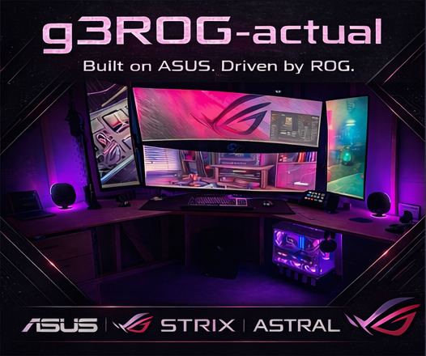

# Visual Gallery

This page collects lightweight visual proof artifacts for the g3ROG build dossier.

## Gallery Status

- Current flagship: [G3ROG-DARK](machines/g3rog-dark/README.md)
- Current G3ROG-DARK visual set: pending fresh photos/screenshots
- Historical visual set: April 2026 `g3ROG-actual` snapshot

## G3ROG-DARK

The current flagship now has its first real visual set.

- [G3ROG-DARK friends showcase HTML](machines/g3rog-dark/exports/G3ROG-DARK-showcase-spec-2026-05-08.html)
- [G3ROG-DARK machine page](machines/g3rog-dark/README.md)
- [README banner](../assets/images/g3rog-dark-banner-2026-05-08.jpg)
- [GitHub social preview card](../assets/social/g3rog-dark-social-preview-2026-05-08.jpg)

### Showcase Assets

### Chassis Photos

| Angled chassis | Front side-panel | Close side-panel |
| --- | --- | --- |
|  |  |  |

Still worth adding later:

- full desk / monitor wall
- BIOS or Armoury Crate summary, with private identifiers redacted
- Speedtest or network validation, with private details redacted
- benchmark screenshots, when available

## Historical g3ROG-actual Snapshot

These images support the April 2026 `g3ROG-actual` record. They are preserved as historical proof artifacts now that G3ROG-DARK is the current flagship.

### Repo Social Preview

- Asset: [social-preview_2026-04-16.png](../assets/social/social-preview_2026-04-16.png)
- Format: `PNG`
- Use: GitHub social/share preview asset
- Notes: final locked repo asset supplied by the repo owner

### Battlestation

- Capture date: 2026-04-16
- View: full desk, monitor stack, and under-desk chassis presentation
- Notes: historical public-facing battlestation image for the pre-DARK snapshot

### Motion Clip

- [Download battlestation clip](../assets/gallery/g3rog-actual_2026-04-16.mov)
- Format: `.mov`
- Use: optional ambient proof-of-setup asset rather than a primary document artifact

## Historical Network Validation

### Desktop Speedtest.net Result

- Provider: Frontier
- Server: Secaucus, NJ
- Result: 2347.18 Mbps down / 2224.44 Mbps up
- Ping: 6 ms

### eero Max 7 Gateway Result

- Connection: wired internet via eero Max 7 gateway
- Result: 2.36 Gbps down / 2.55 Gbps up
- Captured: 2026-04-15 at 20:17 local time

## Notes

- These images are proof artifacts, not long-term telemetry dashboards.
- Redact or replace future screenshots if they expose details you would not want indexed publicly.
- GitHub's custom social preview image still requires a Settings UI upload step; this asset is ready for that use.
