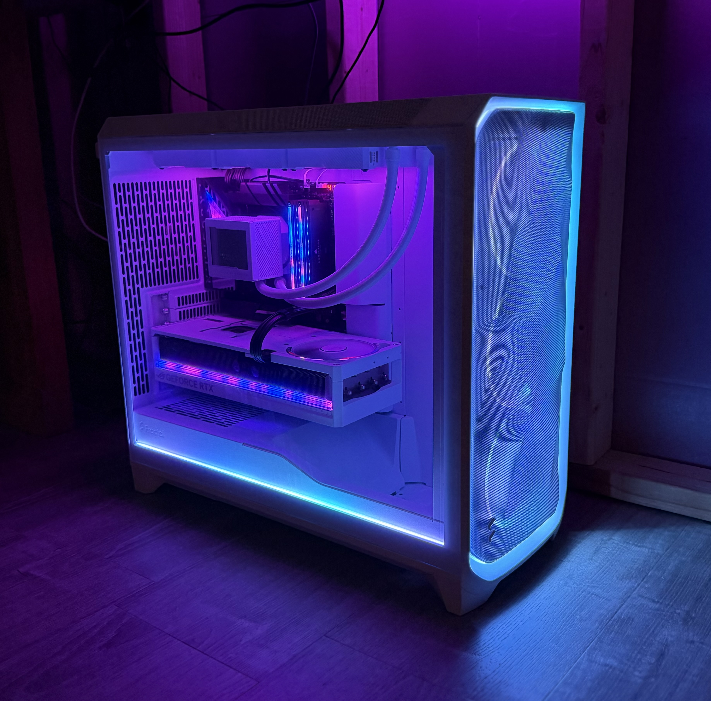
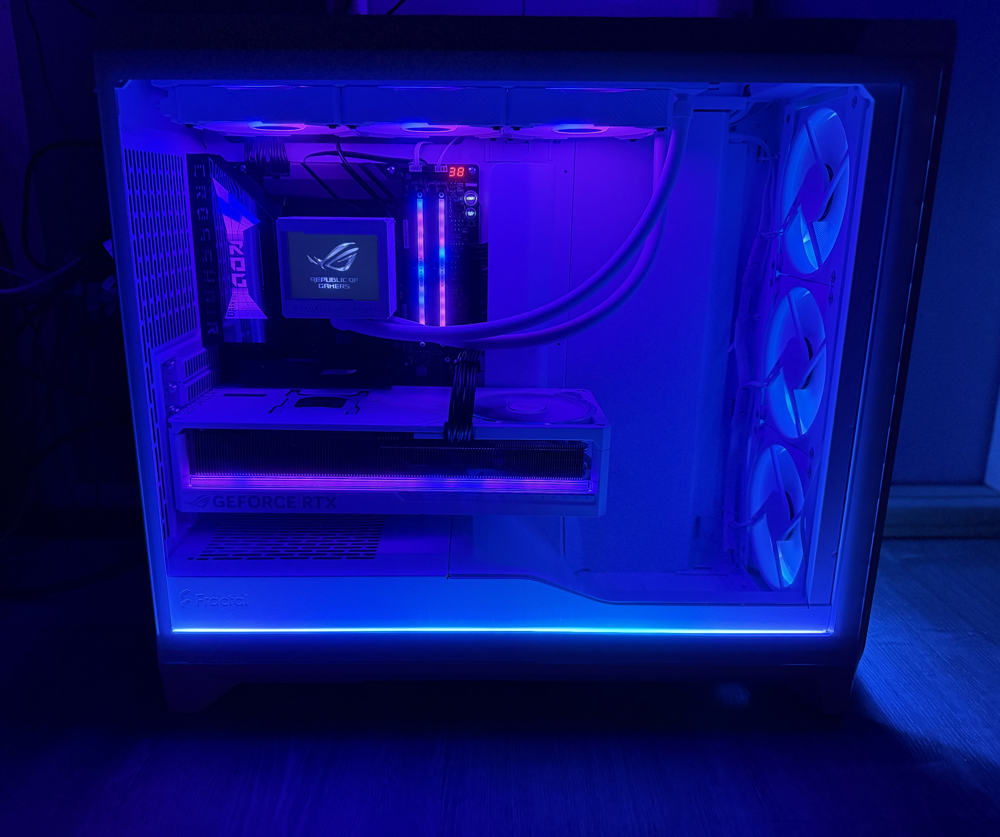
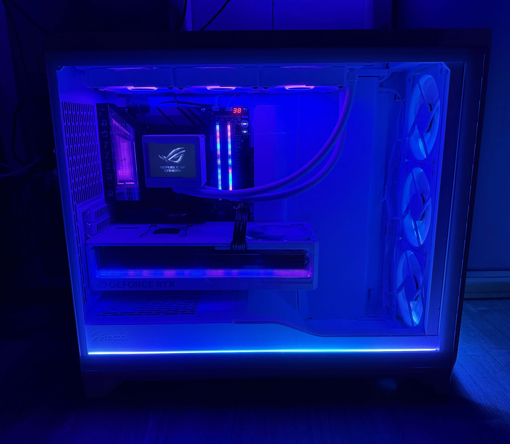

# G3ROG-DARK

**G3ROG-DARK** is the current flagship machine in the g3ROG family: X870E Dark Hero, Ryzen 7 9850X3D, ROG Astral RTX 5090, 64GB Corsair Dominator DDR5, Gen5 NVMe, and the four-display command wall.

## Start Here

- [Current source-of-truth spec](../../g3ROG-DARK-spec.md)
- [Current source-of-truth spec HTML](../../g3ROG-DARK-spec.html)
- [BIOS settings](../../bios-settings.md)
- [Stability validation plan](../../stability-validation.md)
- [AIDA64 source notes](../../aida64/README.md)
- [Share-safe friends showcase HTML](exports/G3ROG-DARK-showcase-spec-2026-05-08.html)
- [Detailed actual spec HTML](exports/G3ROG-DARK-actual-spec-2026-05-08.html)
- [Share-safe markdown spec](specs/G3ROG-DARK-showcase-spec-2026-05-08.md)
- [Detailed markdown spec](specs/G3ROG-DARK-actual-spec-2026-05-08.md)
- [Full gallery](../../GALLERY.md)

## Snapshot

| Field | Value |
| --- | --- |
| Call sign | G3ROG-DARK |
| Snapshot date | 2026-05-09 source update, original showcase photos from 2026-05-08 |
| Role | Current flagship / daily driver |
| Source | Sanitized AIDA64 Report `AIDA64-Report-20260509_v2`, build notes, and exported spec sheets |
| Public posture | Showcase-first, private identifiers omitted |

## Core Spec

| Component | Detail |
| --- | --- |
| CPU | AMD Ryzen 7 9850X3D, 8 cores / 16 threads, 96 MB L3 cache |
| Motherboard | ASUS ROG Crosshair X870E Dark Hero |
| BIOS | ASUS / American Megatrends 0804, release date 2026-04-09 |
| GPU | ASUS ROG Astral GeForce RTX 5090 O32G White |
| Memory | 64GB Corsair Dominator Titanium, observed DDR5-6200 |
| Storage | Crucial T705 2TB, Crucial T705 1TB, 2x Samsung 860 EVO 2TB |
| Cooling | ASUS ROG Ryujin III 360 ARGB AIO |
| PSU | Corsair HX1500i Platinum 1500W |
| Case | Fractal Design Meshify 3 XL Ambience Pro RGB White TG Clear Tint |
| Displays | 2x LG UltraGear 49-inch class and 2x Sceptre P30 ultrawides |
| Network | Realtek 10GbE active, Realtek 5GbE and Wi-Fi 7 available |

## Baseline Snapshot

These values are point-in-time idle/light-load baseline readings from the uploaded reports, not stress-test proof. The 2026-05-09 source updated the CPU package and fan snapshot compared with the original showcase page.

| Sensor | Reading |
| --- | --- |
| Motherboard | 37 C |
| CPU | 50 C |
| CPU package | 60 C |
| VRM | 46 C |
| RTX 5090 GPU | 33 C |
| RTX 5090 memory | 44 C |
| Crucial T705 2TB | 53 C |
| Crucial T705 1TB | 43 C |
| AIO pump | 3524 RPM |
| Board-estimated system power | 274.02 W |

## Visual Proof

| Angled chassis | Front side-panel | Close side-panel |
| --- | --- | --- |
|  |  |  |

## Notes

- The showcase HTML is the best first link for friends and visitors.
- The detailed HTML and markdown are useful for maintenance, audits, and future comparison.
- The detailed source contains operational context. Keep it reviewed for private details before publishing outside the repo.
- SMT is restored to Auto / enabled; the 2026-05-09 sanitized source confirms 8 physical cores and 16 logical processors.
- Memory was observed at DDR5-6200 with 32-38-38-80 1T timing. Keep stability testing notes with this machine if that profile stays.
- Exact M.2 physical slot mapping still needs verification because SMBIOS slot occupancy does not fully match the detected NVMe inventory.
- One Samsung 860 EVO has a high historical C7 CRC counter; check whether it continues increasing before blaming the SSD itself.
- Avoid using the X870E Dark Hero M.2 slot that trades bandwidth with rear USB4 unless that tradeoff is intentional.
